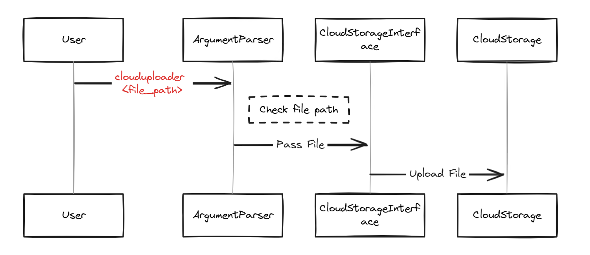

# CloudUploader-CLI
The CloudUploader CLI is a bash-based tool that allows users to quickly upload files to Azure Blob Storage. It aims to provide a simple and seamless upload experience.

## 1. Project Overview
- The CloudUploader CLI is a bash-based tool that allows users to quickly upload files to Azure Blob Storage. It aims to provide a simple and seamless upload experience.

## 2. To-Do Steps
### 2.1 Create a GitHub Repository
- Start by creating a GitHub repository for your project. Make sure to leverage branches and commit your code often.

### 2.2 Setup & Authentication
- Choose Azure Blob Storage as your cloud provider.
- Use `az login` to set up your credentials.

### 2.3 CLI Argument Parsing
- Use bash's built-in $1, $2, etc., to parse command-line arguments. $1 could be the filename or path.
- Optionally, allow additional arguments like target cloud directory, storage class, or any other cloud-specific attributes.

### 2.4 File Check
- Before uploading, check if the file exists using [ -f $FILENAME ].
- Provide feedback if the file is not found.

### 2.5 File Upload
- Use Azure CLI to upload the file.

### 2.6 Upload Feedback
- On successful upload, provide a success message.
- If there's an error, capture the error message and display it to the user.

### 2.7 Advanced Features (Optional)
- Allow multiple file uploads at once.
- Add a progress bar or percentage upload completion using tools like pv.
- Provide an option to generate and display a shareable link post-upload.
- Enable file synchronization -- if the file already exists in the cloud, prompt the user to overwrite, skip, or rename.
- Integrate encryption for added security before

### Architecture CloudUploader CLI tool:

